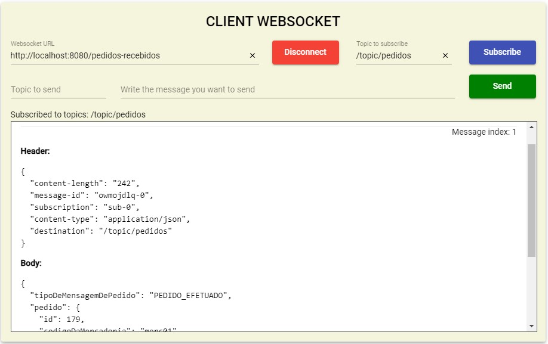
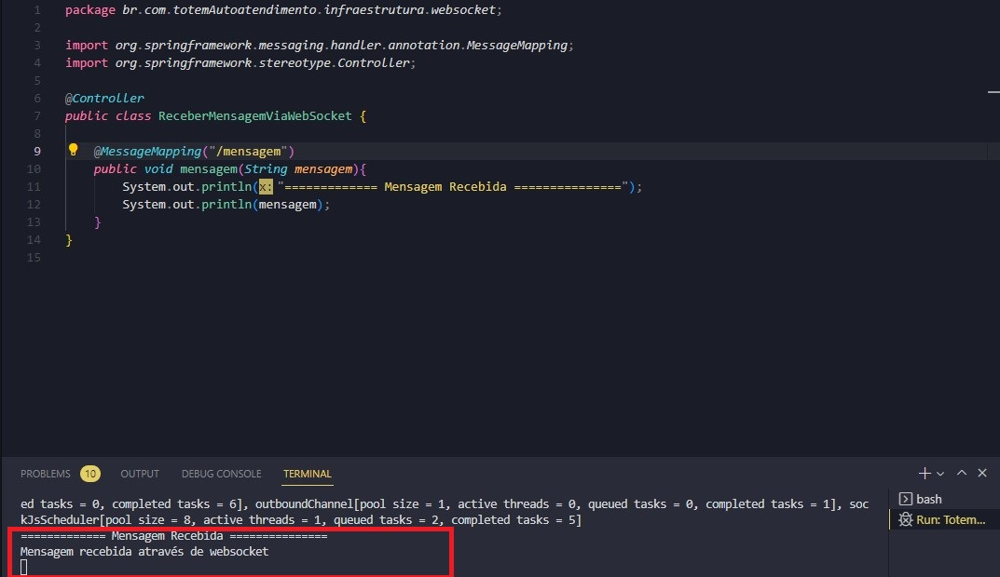

# WebsocketClientTester

Aplicação desenvolvida com Angular para testes de websocket. Com a aplicação é possível se conectar com uma url, fazer subscribe em tópicos e publicar mensagens, possibilitando testar alguma API com a funcionalidade de websocket.

Exemplo de uma mensagem sendo recebida.

Exemplo de uma api com Springboot recebendo uma mensagem enviada pela aplicação

## 🚀 Executando
Para rodar a aplicação basta utilizar o comando `ng serve` e a aplicação vai rodar em `http://localhost:4200`

## 🛠️Construído com

* Angular
* Sockjs
* Stompjs

---
## ✒️ Autor
* Douglas Ferreira da Silva
